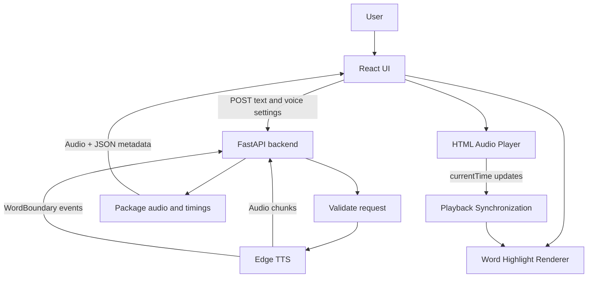

# EchoRead — System Architecture

## 1. Project Overview

EchoRead is a web-based read-along text-to-speech application. A user enters or pastes text, selects a voice and speech settings, and generates spoken audio. While the audio plays, the application highlights the corresponding word (and optionally its sentence) in the displayed text. Users can pause, resume, seek, replay, and download generated audio.

The initial release focuses on **text-to-speech with synchronized word highlighting**. Speech-to-text (microphone transcription) is a possible later feature and is not part of the initial implementation.

## 2. Goals

- Convert user-provided text into natural-sounding speech using Edge TTS.
- Capture word-boundary timing metadata during speech generation.
- Keep highlighted text synchronized with audio playback, including pause, resume, and seeking.
- Provide a clear, responsive React interface.
- Keep the frontend and speech-generation logic separate through a documented API.
- Handle errors and long-running generation gracefully.

## 3. Out of Scope for the Initial Release

- Speech-to-text or live microphone transcription.
- User accounts, authentication, and cloud-saved libraries.
- Voice cloning or custom voice training.
- Offline speech generation. Edge TTS requires an internet connection to generate audio.
- Advanced document import (PDF/DOCX) unless added as a later milestone.

## 4. Technology Stack

| Layer | Technology | Responsibility |
|---|---|---|
| Frontend | React + JavaScript | User interface and application state |
| Frontend tooling | Vite | Development server and production build |
| Styling | CSS / project-selected styling system | Layout, responsive design, highlighting and themes |
| Backend | Python + FastAPI | HTTP API, validation and coordination of speech generation |
| TTS engine | `edge-tts` Python package | Generate speech and emit word-boundary events |
| Audio playback | Browser HTML Audio API | Play, pause, seek, track current playback time |
| Data exchange | JSON + audio binary | Return word timing metadata and generated audio |

Use the project's existing package and dependency conventions where possible. Keep secrets out of frontend code; the initial Edge TTS integration does not require the app to expose a user API key.

## 5. High-Level Architecture



### Component responsibilities

**React frontend**
- Collect text, voice, rate, pitch and volume settings.
- Submit generation requests and show loading/error states.
- Render text as individually addressable word tokens while preserving spaces and punctuation.
- Manage audio playback controls and the active word index.
- Synchronize highlighting against audio playback time.
- Allow audio download when generation succeeds.

**FastAPI backend**
- Validate request size and supported settings.
- Invoke Edge TTS asynchronously.
- Collect audio chunks and word-boundary metadata from the same generation.
- Return a stable response format to the frontend.
- Handle upstream errors and avoid exposing internal tracebacks to users.

**Edge TTS adapter**
- Encapsulate the `edge-tts` package behind a small backend service/module.
- Convert Edge TTS word-boundary offsets and durations from 100-nanosecond units to seconds.
- Preserve event order and associate each event with its spoken text.
- Keep package-specific event handling out of API route code.

## 6. Main User Flow

1. User opens EchoRead.
2. User enters or pastes text.
3. User chooses a voice and optional speech settings.
4. User clicks **Generate**.
5. React sends the text and settings to FastAPI.
6. FastAPI validates the request and starts Edge TTS generation.
7. The backend collects the audio and word-boundary events.
8. The backend returns audio and timing metadata.
9. React loads the audio and displays the text in synchronized word spans.
10. When playback starts, React reads the audio player's current time and identifies the active timing interval.
11. The corresponding word is highlighted. Pause, resume, seek and replay update the highlight from the current audio time.
12. User can download the generated audio.

## 7. Frontend Structure

Suggested structure (adapt to the agent's existing project rather than duplicating files):

```text
frontend/
  src/
    components/
      TextEditor.jsx
      VoiceSettings.jsx
      AudioPlayer.jsx
      ReadAlongText.jsx
      GenerationStatus.jsx
    hooks/
      useAudioPlayback.js
      useWordHighlight.js
    services/
      ttsApi.js
    utils/
      tokenizeText.js
      findActiveWord.js
    App.jsx
    main.jsx
```

### Key UI components

- **TextEditor**: multiline input, character count and clear action.
- **VoiceSettings**: voice selector and rate/pitch/volume controls.
- **GenerationStatus**: idle, loading, success and error states.
- **AudioPlayer**: play/pause, progress, elapsed/duration display, seek and download.
- **ReadAlongText**: readable text with active-word and optional active-sentence styles.

### Frontend state

Keep a single coherent state source for the current text, settings, generated audio URL, word timings, generation status and playback position. Revoke any created browser object URLs when they are no longer needed to avoid memory leaks.

The active word should be derived from the current audio time and timing metadata, rather than advanced by a timer. This keeps highlighting aligned when the user pauses or seeks.

## 8. Backend Structure

Suggested structure:

```text
backend/
  app/
    main.py
    api/
      routes_tts.py
    schemas/
      tts.py
    services/
      edge_tts_service.py
    core/
      config.py
  requirements.txt
```

### Backend responsibilities

- `main.py`: create FastAPI app and configure CORS for the development frontend origin.
- `routes_tts.py`: define API endpoints and HTTP response behavior.
- `schemas/tts.py`: request and response validation models.
- `edge_tts_service.py`: generate audio and collect word timings.
- `config.py`: centralize allowed origins, text limits and configurable defaults.

Use asynchronous generation so the server can handle other requests while waiting for the TTS service. Add a reasonable input-length limit and return a clear error for empty or excessively long text.

## 9. API Contract

### `POST /api/tts/generate`

Accept JSON:

```json
{
  "text": "Hello! Welcome to EchoRead.",
  "voice": "en-US-AriaNeural",
  "rate": "+0%",
  "volume": "+0%",
  "pitch": "+0Hz"
}
```

For the initial implementation, return a `multipart/mixed` response containing:

1. An `audio/mpeg` part containing the generated MP3 bytes.
2. An `application/json` part containing metadata.

Example metadata:

```json
{
  "audio_format": "mp3",
  "duration_seconds": null,
  "words": [
    { "text": "Hello!", "start": 0.0, "duration": 0.42 },
    { "text": "Welcome", "start": 0.55, "duration": 0.38 },
    { "text": "to", "start": 0.94, "duration": 0.16 },
    { "text": "EchoRead.", "start": 1.12, "duration": 0.61 }
  ]
}
```

The numbers above are illustrative only. Real timing values must come from Edge TTS events. `duration_seconds` may be omitted or null if it is not reliably available from the generated stream.

**Implementation note:** If multipart handling adds unnecessary complexity for the first version, use a simpler two-step API: generate audio and metadata, then return an audio URL or a generated file identifier from a temporary storage location. Do not return a local filesystem path that the browser cannot access. Document cleanup and expiry for temporary files. The agent should choose one response strategy and implement it consistently across backend and frontend.

### `GET /api/tts/voices` (optional but recommended)

Return a list of voices supported by the backend, with fields such as `ShortName`, `Gender`, `Locale` and `FriendlyName`. The frontend should use returned voice IDs rather than hardcoding an assumed complete list.

### Error response

Use a consistent JSON error shape, for example:

```json
{
  "detail": {
    "code": "TTS_GENERATION_FAILED",
    "message": "Speech generation failed. Please try again."
  }
}
```

Do not expose stack traces or sensitive server details to the browser.

## 10. Word Timing and Synchronization

Edge TTS can emit `WordBoundary` events while streaming. Each event includes text and timing information. The backend should normalize these into seconds and return an ordered array.

For each word timing:

- `text`: word text from the TTS event.
- `start`: start time in seconds relative to the generated audio.
- `duration`: event duration in seconds.

The active interval is generally `[start, start + duration)`. The frontend should find the timing entry containing `audio.currentTime`. If there is no exact interval at the current time (silence, punctuation gap or timing gap), retain no active word or use a clearly documented nearest-word policy. Do not assume each word has the same duration.

### Text alignment

The original input text and TTS event text may differ in punctuation, whitespace, or normalization. The frontend/backend must preserve a mapping from TTS word events to displayed text tokens. Avoid simply assuming that array index `i` always maps to the `i`th whitespace-separated token. Handle punctuation attached to words, repeated words, contractions, and line breaks. If exact alignment cannot be established, fall back to sentence-level highlighting or report the limitation rather than highlighting the wrong word.

### Playback behavior

- On play: derive active word from current playback time.
- On pause: freeze audio; active word remains based on the paused time.
- On seek: recalculate active word immediately.
- On ended: clear active word or mark the final word as complete, consistently.
- On replay: reset playback and highlight from the beginning.
- On generation replacement: stop old audio and clear old timings before loading new content.

Use `requestAnimationFrame` or a suitably paced playback-time update mechanism for smooth visual updates, but always derive the active word from the audio clock rather than incrementing word indices independently.

## 11. Audio Delivery and Temporary Storage

For a small initial prototype, audio may be held in memory for the request and returned to the client. For larger texts or multiple concurrent users, prefer temporary file/object storage with unique IDs, expiry and cleanup.

Requirements:
- Never use a user-provided filename as a server path.
- Use unique generated names/IDs.
- Enforce text-size and request limits.
- Clean up temporary audio after expiry or when safe to do so.
- Avoid logging full user text by default.

## 12. UI/UX Requirements

- Clean, modern, responsive interface for desktop and mobile.
- Clear text entry area and visible character count.
- Accessible voice and speech-setting controls.
- Distinct active-word highlight with sufficient contrast in light and dark themes, if both themes are implemented.
- Sentence highlight may be a subtler style than the active word.
- Playback controls should remain usable on narrow screens.
- Loading feedback while speech is generated; prevent accidental duplicate submissions.
- Helpful empty, loading, success and error states.
- Keyboard-accessible controls and visible focus states.
- Respect reduced-motion preferences; avoid relying on animation alone to communicate the active word.

## 13. Security, Reliability and Constraints

- Configure CORS for known frontend origins; do not use unrestricted origins in production.
- Validate text and settings on the backend, even if the frontend also validates them.
- Set request timeouts and handle Edge TTS/network failures.
- Limit concurrent generation and input size to reduce resource abuse.
- Do not claim offline generation: Edge TTS requires network access.
- Treat Edge TTS as an external service dependency; its unofficial package/service behavior may change.
- Do not commit generated audio, environment files or secrets unless intentionally required.
- Keep user text out of application logs unless explicitly needed for debugging and approved.

## 14. Testing and Acceptance Criteria

### Functional

- User can submit non-empty text and receive playable audio.
- Generated audio uses the selected voice and supported settings.
- Word-boundary metadata is returned in chronological order.
- Highlighting follows the spoken audio during normal playback.
- Pause, resume, seek, replay and end-of-audio states behave correctly.
- Downloaded audio plays outside the application.
- Invalid text/settings and upstream failures show understandable errors.

### Alignment

- Test short text, long text, punctuation, contractions, repeated words, numbers, abbreviations and multiline input.
- Verify that displayed token mapping remains correct when TTS event text differs slightly from source formatting.
- Confirm that seeking forward and backward updates the highlighted word without drift.

### Engineering

- Frontend production build succeeds.
- Backend starts and API documentation is available through FastAPI's generated OpenAPI interface in development.
- CORS works for the configured local frontend origin.
- No frontend code depends on backend filesystem paths.

## 15. Suggested Milestones

1. **Foundation**: initialize React/Vite and FastAPI; verify frontend-to-backend communication.
2. **Speech generation**: integrate Edge TTS and save/return generated audio.
3. **Timing metadata**: capture and normalize `WordBoundary` events.
4. **Read-along UI**: render tokens and synchronize active-word highlighting with audio time.
5. **Playback controls**: implement seek, replay, progress and download.
6. **Polish**: responsive layout, accessibility, robust errors and test cases.
7. **Optional later feature**: add speech-to-text using a separately selected browser or backend recognition solution.

## 16. Agent Implementation Guidance

Before coding, inspect the existing repository, package manager, styling conventions and current application structure. Reuse existing setup where possible and avoid replacing unrelated code or changing project content unnecessarily.

Implement the smallest end-to-end vertical slice first: enter text → generate Edge TTS audio and timings → play audio → highlight the active word. Keep modules focused, document setup commands in a README, and report changed files, commands run, tests/build results and known limitations.

Do not fabricate word timings. Use actual Edge TTS boundary events, and verify the installed `edge-tts` package's current event names and data shape during implementation.
